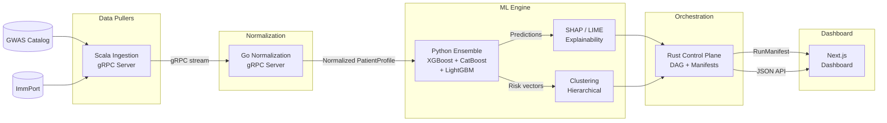
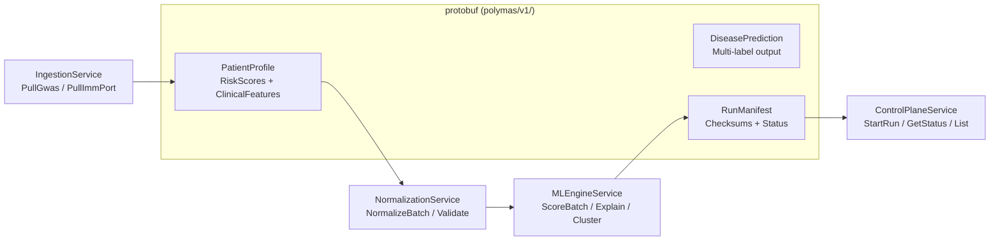

<div align="center">

# PolyMas

**A polyglot, gRPC-driven ML pipeline that predicts multi-disease autoimmune risk from genotypic profiles and tests whether the resulting risk clusters validate or challenge the 1988 Multiple Autoimmune Syndrome classification.**

[]()
[]()
[]()
[]()
[]()
[]()

</div>

---

A multi-label ensemble of XGBoost, CatBoost, and LightGBM — combined via Platt-scaled weighted voting — predicts a patient's simultaneous risk across MAS-associated autoimmune diseases. Predictions are explained with exact SHAP values (TreeExplainer) and LIME, then clustered hierarchically to produce a dendrogram directly comparable to the 1988 Type 1–4 taxonomy. The entire pipeline is orchestrated by a Rust DAG controller that enforces reproducibility via input/output SHA-256 checksums on every run.

---

## Quickstart

```bash
# Generate protobuf stubs and build all services
make proto && make build

# Run the full test suite
make test

# Spin up all containers
make docker-up
```

---

## Pipeline Architecture



### Data Contracts



---

## Services

| Service | Language | Role | Port |
|---------|----------|------|------|
| `ingestion-scala` | Scala 3 (sbt) | REST pulls from GWAS Catalog & ImmPort, gRPC streaming | 50051 |
| `normalization-go` | Go 1.22 | High-concurrency schema normalization & validation | 50052 |
| `control-plane-rust` | Rust (Tokio/Tonic) | DAG orchestration, run manifests, input/output checksums | 50053 |
| `ml-engine-python` | Python 3.12 | Multi-label ensemble (XGBoost/CatBoost/LightGBM), SHAP/LIME, clustering | 50054 |
| `dashboard-nextjs` | Next.js 14 | Neobrutalist UI for predictions, explanations, and cluster visualization | 3000 |

---

## Reproducibility

Every pipeline run produces a `RunManifest` containing:

- **SHA-256 checksums** of all input parameters and output predictions
- **Pipeline version** and model version for exact traceability
- **Run status** (queued / running / completed / failed) with error messages

This guarantees that any result can be audited back to its exact data and code state.

---

## Project Structure

```
├── Makefile                          # Aggregate build/test/lint/clean (all 5 languages)
├── docker-compose.yml                # 6 services + shared network
├── proto/polymas/v1/                 # gRPC/Protobuf data contracts
│   ├── patient.proto                 #   PatientProfile, RiskScores, DiseaseLabel enums
│   └── services.proto               #   Service definitions + RPC signatures
├── services/
│   ├── ingestion-scala/              # Scala API puller (sbt + sttp + circe)
│   ├── normalization-go/             # Go data cleaner (gRPC + goroutine concurrency)
│   ├── control-plane-rust/           # Rust orchestrator (Tokio + Tonic + SHA-256)
│   └── ml-engine-python/             # Python ML engine (GBDT ensemble + SHAP/LIME)
│       ├── polymas_ml/
│       │   ├── models/               #   XGBoost, CatBoost, LightGBM + MultiLabelEnsemble
│       │   ├── explainability/       #   TreeExplainer (exact SHAP) + LIME wrappers
│       │   ├── clustering/           #   Hierarchical clustering + dendrogram JSON gen
│       │   └── serving/              #   gRPC server entry point
│       └── tests/                    #   pytest (ensemble + clustering)
├── apps/
│   └── dashboard-nextjs/             # Next.js dashboard (App Router + Tailwind)
└── scripts/
    ├── bootstrap.sh                  # One-shot full build
    └── Dockerfile.proto              # Protobuf codegen container
```

---

## Status

| Phase | Status |
|-------|--------|
| Problem framing & literature validation | ✅ |
| System architecture & data sources | ✅ |
| ML methodology specification | ✅ |
| Monorepo scaffolding (all 5 services) | ✅ |
| Protobuf data contracts | ✅ |
| Service implementation | ⬜ |
| Dataset construction & feature engineering | ⬜ |
| Model training & tuning | ⬜ |
| Explainability & clustering | ⬜ |
| Dashboard integration | ⬜ |
| Paper submission | ⬜ |

---

## License

See [LICENSE](LICENSE).

---

_[pd241008](https://github.com/pd241008) · [ct-os-dev-portfolio.vercel.app](https://ct-os-dev-portfolio.vercel.app)_
