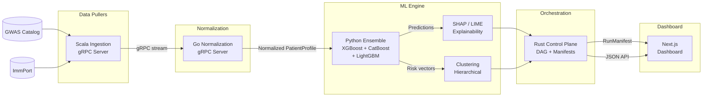
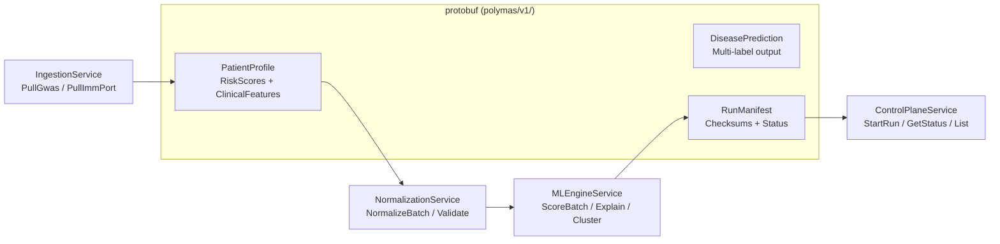

<div align="center">

# PolyMas

**A polyglot, gRPC-driven ML pipeline that predicts multi-disease autoimmune risk from genotypic profiles and tests whether the resulting risk clusters validate or challenge the 1988 Multiple Autoimmune Syndrome classification.**

> **Honest framing:** no public dataset pairs multi-diagnosis autoimmune patients with genotype data at scale, so the cohort is semi-synthetic: real ImmPort demographics + real GWAS Catalog effect sizes, with simulated genotypes and co-occurrence-structured labels (latent liability mixture + MAS pairwise log-OR affinities, literature-anchored). The cohort therefore *contains* MAS-pattern patients (3+ concurrent diagnoses) by construction — but they are generated, not observed. Every result is a statement about this disclosed generative process.

[]()
[]()
[]()
[]()
[]()
[]()

</div>

---

A multi-label ensemble of XGBoost, CatBoost, and LightGBM — combined via Platt-scaled weighted voting — predicts a patient's simultaneous risk across MAS-associated autoimmune diseases. Predictions are explained with exact SHAP values (TreeExplainer) and LIME, then clustered hierarchically to produce a dendrogram directly comparable to the 1988 Type 1–4 taxonomy. The entire pipeline is orchestrated by a Rust DAG controller that enforces reproducibility via input/output SHA-256 checksums on every run.

---

## Quickstart

```bash
# Generate protobuf stubs and build all services
make proto && make build

# Run the full test suite
make test

# Spin up all containers
make docker-up
```

---

## Pipeline Architecture


```mermaid
flowchart LR
    subgraph Pull["Data Pullers"]
        SC[Scala Ingestion<br/>gRPC Server]
    end

    subgraph Clean["Normalization"]
        GO[Go Normalization<br/>gRPC Server]
    end

    subgraph ML["ML Engine"]
        PY[Python Ensemble<br/>XGBoost + CatBoost<br/>+ LightGBM]
        SH[SHAP / LIME<br/>Explainability]
        CL[Clustering<br/>Hierarchical]
    end

    subgraph Control["Orchestration"]
        RS[Rust Control Plane<br/>DAG + Manifests]
    end

    subgraph UI["Dashboard"]
        NJ[Next.js<br/>Dashboard]
    end

    GWAS[(GWAS Catalog)] --> SC
    Imm[(ImmPort)] --> SC
    SC -->|gRPC stream| GO
    GO -->|Normalized PatientProfile| PY
    PY -->|Predictions| SH
    PY -->|Risk vectors| CL
    SH --> RS
    CL --> RS
    RS -->|RunManifest| NJ
    RS -->|JSON API| NJ
```

### Data Contracts


```mermaid
flowchart LR
    subgraph Proto["protobuf (polymas/v1/)"]
        PP[PatientProfile<br/>RiskScores + ClinicalFeatures]
        DP[DiseasePrediction<br/>Multi-label output]
        RM[RunManifest<br/>Checksums + Status]
    end

    IC[IngestionService<br/>PullGwas / PullImmPort] --> PP
    PP --> NC[NormalizationService<br/>NormalizeBatch / Validate]
    NC --> MC[MLEngineService<br/>ScoreBatch / Explain / Cluster]
    MC --> RM
    RM --> CC[ControlPlaneService<br/>StartRun / GetStatus / List]
```

---

## Services

| Service | Language | Role | Port |
|---------|----------|------|------|
| `ingestion-scala` | Scala 3 (sbt) | REST pulls from GWAS Catalog & ImmPort, gRPC streaming | 50051 |
| `normalization-go` | Go 1.22 | High-concurrency schema normalization & validation | 50052 |
| `control-plane-rust` | Rust (Tokio/Tonic) | DAG orchestration, run manifests, input/output checksums | 50053 |
| `ml-engine-python` | Python 3.12 | Multi-label ensemble (XGBoost/CatBoost/LightGBM), SHAP/LIME, clustering | 50054 |
| `dashboard-nextjs` | Next.js 14 | Neobrutalist UI for predictions, explanations, and cluster visualization | 3000 |

---

## Reproducibility

Every pipeline run produces a `RunManifest` containing:

- **SHA-256 checksums** of all input parameters and output predictions
- **Pipeline version** and model version for exact traceability
- **Run status** (queued / running / completed / failed) with error messages

This guarantees that any result can be audited back to its exact data and code state.

---

## Results Program

Feature development is tracked as a 24-item claim ledger in [docs/ROADMAP.md](docs/ROADMAP.md):
every item carries a typed verification level (R1 exact / R2 deterministic /
R3 statistical / R4 archival), pre-registered tolerances for statistical checks,
and an honest status — passes, failures, and null results all get logged. ADRs
for program decisions live in `docs/adr/`.

---

## Project Structure

```
├── Makefile                          # Aggregate build/test/lint/clean (all 5 languages)
├── docker-compose.yml                # 6 services + shared network
├── proto/polymas/v1/                 # gRPC/Protobuf data contracts
│   ├── patient.proto                 #   PatientProfile, RiskScores, DiseaseLabel enums
│   └── services.proto               #   Service definitions + RPC signatures
├── services/
│   ├── ingestion-scala/              # Scala API puller (sbt + sttp + circe)
│   ├── normalization-go/             # Go data cleaner (gRPC + goroutine concurrency)
│   ├── control-plane-rust/           # Rust orchestrator (Tokio + Tonic + SHA-256)
│   └── ml-engine-python/             # Python ML engine (GBDT ensemble + SHAP/LIME)
│       ├── polymas_ml/
│       │   ├── data/                #   ImmPort subject client + shared patient simulation
│       │   ├── models/              #   XGBoost, CatBoost, LightGBM + MultiLabelEnsemble + focal loss
│       │   ├── sequence/            #   Mamba (selective SSM) model, k-mer datasets, training, SSL
│       │   ├── graph/               #   LD-GNN (System C) over real r² edges
│       │   ├── evaluation/          #   stats, ancestry cuts, conformal sets, uncertainty (NLL/ECE/Brier)
│       │   ├── explainability/      #   TreeExplainer (exact SHAP) + LIME wrappers
│       │   ├── clustering/          #   Hierarchical clustering + dendrogram JSON gen
│       │   └── serving/             #   gRPC server entry point
│       └── tests/                    #   pytest (131 tests: ensemble, clustering, focal, conformal, uncertainty, SSL, …)
├── apps/
│   └── dashboard-nextjs/             # Next.js dashboard (App Router + Tailwind)
└── scripts/
    ├── bootstrap.sh                  # One-shot full build
    ├── Dockerfile.proto              # Protobuf codegen container
    ├── run_real_pipeline.py          # System A: real data -> features -> ensemble -> clustering
    ├── build_dataset.py              # Semi-synthetic dataset builder
    ├── build_kmer_dataset.py         # System B: k-mer token dataset from System A features
    ├── train_system_b.py             # System B: Mamba training
    ├── run_system_b.py               # System B: Ensembl ref/seq/train/sanity modes
    ├── noise_sweep.py                # F-18 label-noise robustness curves (both systems)
    ├── f01_train_system_c.py         # F-01 LD-GNN (System C) train/evaluate
    ├── f02_disease_graph.py          # F-02 MAS-aware disease-graph head ablation
    ├── f03_hierarchical_mamba.py     # F-03 hierarchical vs flat Mamba (resumable)
    ├── f04_fusion.py                 # F-04 gated late fusion of Systems A+B
    ├── f05_focal_loss.py             # F-05 focal / cost-sensitive loss ablation
    ├── f11_conformal.py              # F-11 split-conformal coverage audit
    ├── f13_tune_system_a.py          # F-13 Optuna sweep, System A (50 trials)
    ├── f13_tune_system_b.py          # F-13 Optuna sweep, System B (30 trials)
    ├── f13_retrain_system_b.py       # F-13 full-budget retrain of swept config
    ├── f14_ssl_pretrain.py           # F-14 masked k-mer SSL pretrain + paired FT
    ├── f15_uncertainty.py            # F-15 deep ensemble + MC-dropout
    ├── run_stats_eval.py             # Bootstrap CIs, ancestry cuts, silhouette perm test
    ├── system_b_curves.py            # F-18/F-19 System B arms (resumable CLI)
    ├── generate_figures.py           # Publication figures (28) from results/
    └── generate_results_pdf.py       # results/results.pdf report generator
```

---

## Artifacts & what gets committed

`results/` is the home for all pipeline artifacts — the canonical run
(`results/results_final_20260926/`), archived System A runs
(`results/system_a_run_<date>/`; fresh runs write `system_a_run_current/`),
phase bundle exports (`results/bundles/`), publication figures
(`results/figures/`), and generated reports (`results/results.pdf`). A fresh
run recreates any missing subdirectory automatically; `POLYMAS_RESULTS_DIR`
overrides the root in every run/reader script.

**Commit policy (see `results/README.md`):** summary/metrics JSONs ≤ 300 KB are
tracked — the auditable numeric record (~13 MB, 400+ files). CSVs, parquet/model
checkpoints, and the two heavy re-fetchable JSON classes stay local. Everything
visual ships later: **figures and PDFs are withheld until the paper is
finalised**, then released alongside it.

---

## Status

| Phase | Status |
|-------|--------|
| Problem framing & literature validation | ✅ |
| System architecture & data sources | ✅ |
| ML methodology specification | ✅ |
| Monorepo scaffolding (all 5 services) | ✅ |
| Protobuf data contracts | ✅ |
| Phase 1 — data substrate (real 1000G genotypes, 91-locus panel, LD gate) | ✅ |
| Phase 2 — honesty layer (held-out discipline, PRS baseline, external sign validation, noise/scaling curves) | ✅ |
| Phase 3 — model architectures (hierarchical Mamba PASS; LD-GNN, disease-graph head, focal loss, fusion: honest fails w/ mechanisms) | ✅ |
| Phase 4 — calibration & uncertainty (conformal PASS; deep-ensemble PASS marginal; HPO split; SSL honest fail) | ✅ |
| Service implementation (Phase 5 productization) | ⬜ |
| Dashboard integration | ⬜ |
| Paper submission | ⬜ |

> 19 of 24 ledger items evaluated (passes and honest fails both count).
> Three follow-ups deliberately deferred with rationale — see "⏸ Deferred" in
> [docs/ROADMAP.md](docs/ROADMAP.md). Two systems: **System A** (GBM ensemble,
> test macro AUROC 0.616; tuned single LightGBM 0.649) and **System B**
> (hierarchical Mamba over k-mer token sequences, val 0.575).

---

## License

See [LICENSE](LICENSE).

---

_[pd241008](https://github.com/pd241008) · [ct-os-dev-portfolio.vercel.app](https://ct-os-dev-portfolio.vercel.app)_
